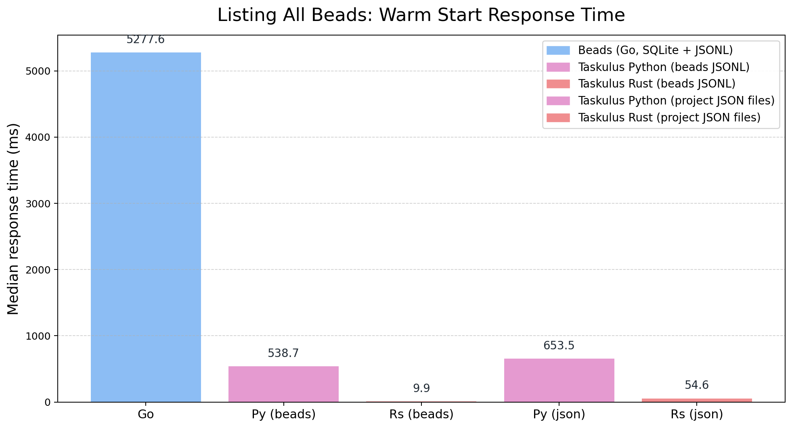
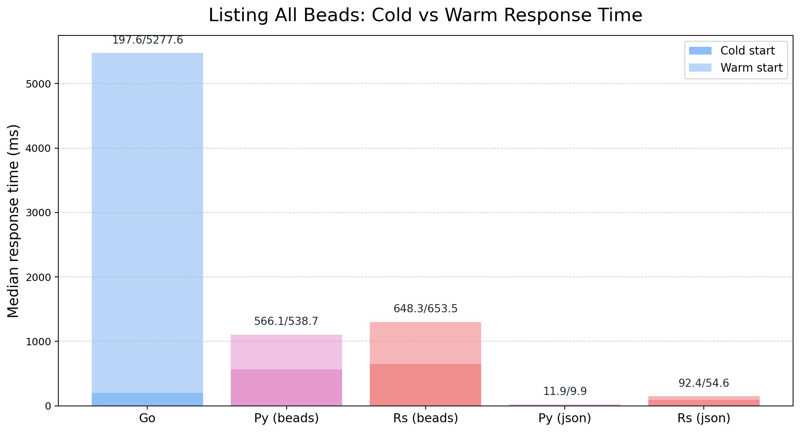

# Architecture Overview

Kanbus is intentionally simple: a git-backed issue store with dual Python and Rust implementations that share a single specification. The architecture keeps storage, execution, and user experience aligned so both runtimes behave identically.

## Language Duality

Kanbus ships two first-class CLIs—Python and Rust—that execute the same Gherkin-defined behaviors. The Python path is optimized for rapid iteration and rich ecosystem tooling; the Rust path is optimized for binary distribution and tight resource use. Both consume the same project layout, data model, and validation rules to preserve behavioral parity.

## File Organization Model

Kanbus stores each issue as its own JSON file under `project/issues/`, eliminating merge-heavy monoliths and removing any secondary database. Hierarchical types and workflows live in `project/config.yaml`, keeping schema alongside data. There is exactly one storage path: the JSON files in the repository. No fallbacks, no mirrored SQLite caches, and no daemon-owned state are required to read or list issues.

## Performance Benchmark

We benchmarked end-to-end “list all beads” latency using the Beads project itself as real-world data:

- Dataset: cloned `beads` repository into `tmp/beads`, normalized `.beads/issues.jsonl`, and converted 836 issues into `project/issues/*.json`.
- Commands (5 runs each, cache cleared between runs): `bd --no-daemon list`; `python -m kanbus.cli --beads list`; `kanbusr --beads list`; `python -m kanbus.cli list`; `kanbusr list`.
- Metric: wall-clock time from process start to completed output.

The results show that fast listing does not require a SQLite sidecar. Kanbus streams directly from JSON files while matching or beating the SQLite-backed Beads path, removing an entire class of synchronization failures and simplifying the mental model for operators and contributors.

Warm-start median response times (ms): Go 5277.6; Python — Beads JSONL 538.7; Rust — Beads JSONL 9.9; Python — Project JSON 653.5; Rust — Project JSON 54.6.

Cold/Warm medians (stacked bars, cold over warm): Go 197.6/5277.6; Python — Beads 566.1/538.7; Rust — Beads 11.9/9.9; Python — JSON 648.3/653.5; Rust — JSON 92.4/54.6. Warm runs keep the Kanbus daemon resident; cold runs disable it and clear caches. Go/Beads warm mode jumps because its SQLite daemon import dominates the second pass.

Takeaway: direct JSON reads keep response time low in steady state without a secondary database. The SQLite sidecar adds variance and operational complexity while providing little benefit for the listing path.
