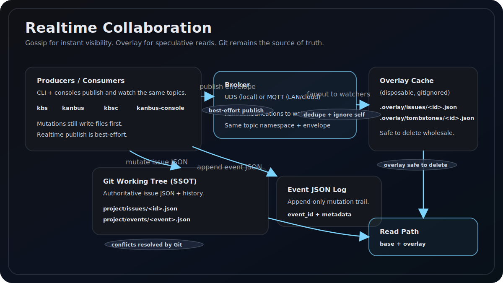

# Realtime Collaboration (Gossip + Overlay Cache)

Kanbus adds a realtime gossip channel plus a speculative overlay cache. Git is still the source of truth. Gossip is for immediate visibility; overlay lets you show updates before Git pulls land.



## Quickstart

### One console hub (UDS)

Terminal 1:

```bash
kbsc
# or: kanbus-console
```

Terminal 2:

```bash
kbs create "Realtime task"
kbs update <id> --status in_progress
kbs delete <id>
```

Watch live UI notifications from the console SSE endpoint:

```bash
curl -N http://127.0.0.1:5174/api/events/realtime
```

`kbsc` subscribes to gossip, writes overlay snapshots/tombstones, and pushes immediate `issue_updated` / `issue_deleted` events to the UI.

If you want raw envelope output for debugging, run an explicit watcher:

```bash
kanbus gossip watch --print
```

### Local MQTT (Mosquitto autostart)

```bash
kanbus gossip watch --transport mqtt --broker auto
# or: kbs gossip watch --transport mqtt --broker auto
```

If Mosquitto is installed and no broker is reachable, Kanbus will autostart a local broker and write `~/.kanbus/run/broker.json`.

## Transport selection

Transport selection follows this rule order:

1. `realtime.transport=uds` forces UDS.
2. `realtime.transport=mqtt` forces MQTT.
3. `realtime.transport=auto` prefers UDS for local console hubs and otherwise falls back to MQTT when UDS is unavailable.

UDS and MQTT share the same topic namespace and message envelope.

UDS default socket path: `$XDG_RUNTIME_DIR/kanbus/bus.sock` (fallback: `~/.kanbus/run/bus.sock`). Override with `realtime.uds_socket_path`. `kbsc` auto-starts a local UDS broker when needed.

## Broker discovery

**Discovery precedence** (explicit exception to the no-fallback policy):

1. `~/.kanbus/run/broker.json` if present
2. `mqtt://127.0.0.1:1883`

If `realtime.broker=off`, realtime is disabled.

## Autostart

Autostart applies only to MQTT:

- If `realtime.autostart=true` and no broker is reachable, Kanbus will start Mosquitto bound to `127.0.0.1` on the first available port.
- Metadata is written to `~/.kanbus/run/broker.json` with `endpoint`, `pid`, and log paths.
- If `realtime.keepalive=false`, a broker started by the current process is stopped on exit.
- Autostart only supports `mqtt://` local brokers. `mqtts://` requires a preconfigured TLS broker.

UDS broker autostart is handled by the console backend (`kbsc`) when transport resolves to UDS.

## Envelope schema

All transports use the same JSON envelope. `issue.mutated` includes the full issue snapshot.

```json
{
  "id": "uuid",
  "ts": "2026-03-06T12:34:56.789Z",
  "project": "KAN",
  "type": "issue.mutated",
  "issue_id": "KAN-123",
  "event_id": "uuid",
  "producer_id": "uuid",
  "origin_cluster_id": "uuid",
  "issue": { "id": "KAN-123", "type": "task", "title": "..." }
}
```

## Dedupe and echo protection

- Each receiver keeps a TTL set of seen `id` values (10–60 minutes).
- Ignore any envelope where `producer_id` matches the current process.
- `origin_cluster_id` is reserved for future broker bridging.

## Overlay merge

Overlay lives under each project directory and is ignored by Git:

```
project/.overlay/issues/<id>.json
project/.overlay/tombstones/<id>.json
```

Merge rule:

1. If a tombstone exists and is newer than base, treat as deleted.
2. Else if an overlay snapshot is newer, return the overlay issue.
3. Else return the Git-backed issue.

## Overlay GC and hooks

- `overlay gc` sweeps stale overlay snapshots and tombstones.
- `overlay install-hooks` installs git hooks to run GC on `post-merge`, `post-checkout`, and `post-rewrite`.

Example:

```bash
kanbus overlay gc --all
kanbus overlay install-hooks
```

## CLI commands

```
kanbus gossip broker [--socket PATH]
kanbus gossip watch [--project LABEL] [--transport auto|uds|mqtt] [--broker auto|off|mqtt://...|mqtts://...] [--autostart|--no-autostart] [--keepalive|--no-keepalive]
kanbus gossip watch [..] [--print]
kanbus overlay gc [--project LABEL] [--all]
kanbus overlay install-hooks
```

Rust installs `kbs` with the same subcommands.

## Deprecated console control commands

The legacy CLI-to-console control channel has been removed. These commands now fail with a migration hint while control messaging is moved to pub/sub:

- `console focus`
- `console unfocus`
- `console view`
- `console search`
- `console maximize|restore|close-detail|toggle-settings|reload|set-setting|collapse-column|expand-column|select`
- `create --focus`

## Config blocks

```yaml
realtime:
  transport: auto
  broker: auto
  autostart: true
  keepalive: false
  uds_socket_path: null
  topics:
    project_events: "projects/{project}/events"

overlay:
  enabled: true
  ttl_s: 86400
```

## Environment overrides

Environment values override `.kanbus.yml` (and `.env` can supply these when not already set):

- `KANBUS_REALTIME_TRANSPORT`
- `KANBUS_REALTIME_BROKER`
- `KANBUS_REALTIME_AUTOSTART`
- `KANBUS_REALTIME_KEEPALIVE`
- `KANBUS_REALTIME_UDS_SOCKET_PATH`
- `KANBUS_REALTIME_TOPICS_PROJECT_EVENTS`
- `KANBUS_OVERLAY_ENABLED`
- `KANBUS_OVERLAY_TTL_S`

## Troubleshooting

- **Mosquitto missing:** install `mosquitto` (macOS: `brew install mosquitto`, Debian/Ubuntu: `apt install mosquitto`).
- **Broker not reachable:** verify `realtime.broker` and `broker.json` endpoint; try `mqtt://127.0.0.1:1883`.
- **UDS socket missing:** start the broker with `kanbus gossip broker`.

## AWS IoT Core outline

AWS IoT Core requires TLS client certificates and a policy allowing publish/subscribe to `projects/{project}/events`. In v1, Kanbus documents the shape of the broker URL (`mqtts://...`) but does not manage certificates automatically.
