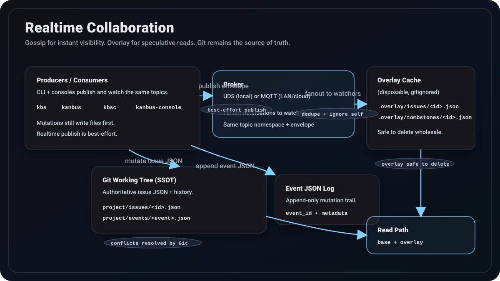

# Realtime Collaboration (Gossip + Overlay Cache)

Kanbus adds a realtime gossip channel plus a speculative overlay cache. Git is still the source of truth. Gossip is for immediate visibility; overlay lets you show updates before Git pulls land.



## When Mosquitto is required vs optional

Mosquitto is **optional** for routine Kanbus CLI board work (`kbs list`, `kbs show`, `kbs create`, `kbs update`, and similar commands). Those commands do not require a local MQTT broker.

Mosquitto is needed only when you explicitly use **local MQTT realtime**:

- `kbs gossip watch --transport mqtt --broker auto`
- MQTT transport with `realtime.autostart=true` and no reachable broker

The default console hub path uses UDS (`kbsc` plus routine CLI mutations). Install Mosquitto only when you want local MQTT gossip outside the console UDS broker.

Set `KANBUS_REALTIME_WARN_MOSQUITTO=0` to suppress the once-per-session Mosquitto install hint for explicit MQTT commands.

## Quickstart

### One console hub (UDS)

Terminal 1:

```bash
kbsc
# or: kanbus-console
```

Terminal 2:

```bash
kbs create "Realtime task"
kbs update <id> --status in_progress
kbs delete <id>
```

Watch live UI notifications from the console SSE endpoint:

```bash
curl -N http://127.0.0.1:5174/api/events/realtime
```

`kbsc` subscribes to gossip, writes overlay snapshots/tombstones, and pushes immediate `issue_updated` / `issue_deleted` events to the UI.

If you want raw envelope output for debugging, run an explicit watcher:

```bash
kanbus gossip watch --print
```

### Local MQTT (Mosquitto autostart)

```bash
kanbus gossip watch --transport mqtt --broker auto
# or: kbs gossip watch --transport mqtt --broker auto
```

If Mosquitto is installed and no broker is reachable, Kanbus will autostart a local broker and write `~/.kanbus/run/broker.json`.

## Always-on local broker (recommended for many worktrees and agents)

Every `kbs`/`kanbus` process in every clone and worktree on the machine publishes to the same
broker, so one always-on broker gives one live stream of everything happening on the system.
Kanbus's autostart only lives as long as the process that started it (`keepalive=false` kills it
on exit) and is not started at boot, so it is not a substitute for a broker you keep running.

**Install:**

```bash
brew install mosquitto                                  # macOS
sudo apt install mosquitto mosquitto-clients             # Debian/Ubuntu
```

Kanbus's own autostart shells out to `mosquitto` via `PATH`. Homebrew installs it under
`/opt/homebrew/sbin` (Apple Silicon) or `/usr/local/sbin` (Intel), which `brew shellenv` adds to
login shells but GUI-launched apps or launchd/cron contexts may not have. Running Mosquitto as
an always-on service (below) sidesteps this entirely, which is one more reason to prefer it over
relying on autostart.

**Configure a loopback-only anonymous listener.** This is explicit because Mosquitto 2.x
defaults changed to refuse anonymous connections. Create or append to the config file — on
Homebrew, `mosquitto.conf` may not exist yet (only `mosquitto.conf.example`), so create it:

- macOS: `$(brew --prefix)/etc/mosquitto/mosquitto.conf`
- Linux: `/etc/mosquitto/conf.d/kanbus-local.conf`

```
listener 1883 127.0.0.1
allow_anonymous true
```

This binds to loopback only. Do not expose it on a network interface without authentication.

**Run as a service that survives reboot:**

```bash
brew services start mosquitto        # macOS: launchd, restarts at login
sudo systemctl enable --now mosquitto   # Linux
```

Check it is up with `mosquitto_sub -h 127.0.0.1 -t 'projects/#' -v`; it should connect and wait.

**Point Kanbus at it once, machine-wide:**

Both lines are required, not just the broker URL:

```bash
kbs setup env KANBUS_REALTIME_BROKER --value mqtt://127.0.0.1:1883
kbs setup env KANBUS_REALTIME_TRANSPORT --value mqtt
```

With `transport: auto` (the default), Kanbus prefers the console's local UDS hub
(`~/.kanbus/run/bus.sock`) whenever one exists, so events never reach the broker even with
`KANBUS_REALTIME_BROKER` set. Forcing `mqtt` routes every Kanbus process on the machine,
including `kbsc`, through the broker. `KANBUS_REALTIME_TRANSPORT` is the same setting a team
later leaves as `mqtt` while flipping the broker to `mqtts://` for a shared AWS IoT endpoint.

An explicit broker URL bypasses `~/.kanbus/run/broker.json` discovery. That file is never
pruned, so if Kanbus previously autostarted a broker, either set the explicit URL (recommended)
or delete `~/.kanbus/run/broker.json`. Autostart stays harmless either way: Kanbus only starts
Mosquitto when the configured broker is unreachable, and only ever kills brokers it started
itself.

**Verify end to end:** keep `mosquitto_sub -h 127.0.0.1 -t 'projects/#' -v` running in one terminal and run
`kbs update <id> --status in_progress` in any checkout; the update should appear in the subscriber.
Throwaway test projects can share a `project_key` (and therefore an MQTT topic) with a real
project, so use the topic in the `mosquitto_sub -v` output to tell them apart.

**Seeing everything:**

- `mosquitto_sub -t 'projects/#' -v` — the raw whole-machine firehose, every project and worktree.
- `kbs gossip watch --print` — follows the projects known to the current checkout (including `virtual_projects`). Do not add `--broker auto` when verifying: `auto` runs Kanbus's own discovery/autostart, ignores the configured broker, and can start a second Mosquitto (observed on port 1884) that writes a stale `~/.kanbus/run/broker.json`. Plain `kbs gossip watch --print` (no `--broker`) uses the configured broker correctly.
- `kbsc` — the board UI for one checkout.

**Next step up:** for a shared broker across a team instead of one machine, see
[CLOUD_CONSOLE_RUNTIME.md](CLOUD_CONSOLE_RUNTIME.md) for a shared AWS IoT broker
(`mqtts://` plus `KANBUS_REALTIME_MQTT_API_TOKEN`) — the same `~/.kanbus.env` settings are all
that change on each developer's machine.

## Transport selection

Transport selection follows this rule order:

1. `realtime.transport=uds` forces UDS.
2. `realtime.transport=mqtt` forces MQTT.
3. `realtime.transport=auto` prefers UDS for local console hubs and otherwise falls back to MQTT when UDS is unavailable.

UDS and MQTT share the same topic namespace and message envelope.

UDS default socket path: `$XDG_RUNTIME_DIR/kanbus/bus.sock` (fallback: `~/.kanbus/run/bus.sock`). Override with `realtime.uds_socket_path`. `kbsc` auto-starts a local UDS broker when needed.

## Broker discovery

**Discovery precedence** (explicit exception to the no-fallback policy):

1. `~/.kanbus/run/broker.json` if present
2. `mqtt://127.0.0.1:1883`

If `realtime.broker=off`, realtime is disabled.

## Autostart

Autostart applies only to MQTT:

- If `realtime.autostart=true` and no broker is reachable, Kanbus will start Mosquitto bound to `127.0.0.1` on the first available port.
- Metadata is written to `~/.kanbus/run/broker.json` with `endpoint`, `pid`, and log paths.
- If `realtime.keepalive=false`, a broker started by the current process is stopped on exit.
- Autostart only supports `mqtt://` local brokers. `mqtts://` requires a preconfigured TLS broker.

UDS broker autostart is handled by the console backend (`kbsc`) when transport resolves to UDS.

## Envelope schema

All transports use the same JSON envelope. `issue.mutated` includes the full issue snapshot.

```json
{
  "id": "uuid",
  "ts": "2026-03-06T12:34:56.789Z",
  "project": "KAN",
  "type": "issue.mutated",
  "issue_id": "KAN-123",
  "event_id": "uuid",
  "producer_id": "uuid",
  "origin_cluster_id": "uuid",
  "issue": { "id": "KAN-123", "type": "task", "title": "..." }
}
```

## Dedupe and echo protection

- Each receiver keeps a TTL set of seen `id` values (10–60 minutes).
- Ignore any envelope where `producer_id` matches the current process.
- `origin_cluster_id` is reserved for future broker bridging.

## Coordination MQTT envelopes

Level 2 coordination uses the configured `realtime.topics.project_events`
topic, which defaults to `projects/{project}/events` with `{project}` replaced
by the project label. MQTT publishes use QoS 0 and `retain=false`; messages are
best-effort hints, while Git event history remains durable. Coordination fields
are top-level envelope fields, not a nested payload.

Every coordination envelope includes the common `id` (unique message UUID),
`ts` (UTC RFC3339 timestamp), `project`, `type`, `event_id`, and `producer_id`
fields. `origin_cluster_id` is optional. `event_id` identifies the immutable
Git event: it identifies the claim event in a CLAIM, the winning claim event in
a LEASE, and the release event in a RELEASE. `producer_id` is stable for the
publishing process.

The type-specific top-level fields are:

| Type | Required fields |
| --- | --- |
| `coordination.claim` | `resource`, `owner`, `claim_id`, `lease_ttl_s` (positive integer seconds) |
| `coordination.lease` | `resource`, `owner`, `claim_id`, `lease_ttl_s`, `expires_at` (UTC RFC3339) |
| `coordination.release` | `resource`, `owner`, `claim_id` |

Receivers deduplicate envelopes by `id` for 3600 seconds and ignore echoes from
their own `producer_id`. MQTT arrival order does not decide claim ownership:
receivers consider unique claim events received in the contention window and
select the lexicographically lowest `(claim_id, owner, event_id)` tuple. A
LEASE reports that selected claim; its `expires_at` is the claim event time
plus its `lease_ttl_s`. A later claim does not displace a selected active
lease. Multiple workers may publish equivalent LEASE envelopes; global
exactly-once publication is not guaranteed. A RELEASE clears soft visibility
only when its `resource`, `owner`, and `claim_id` match the selected lease.
MQTT partitions can still allow duplicate work; these envelopes do not provide
a hard mutex.

## Overlay merge

Overlay lives under each project directory and is ignored by Git:

```
project/.overlay/issues/<id>.json
project/.overlay/tombstones/<id>.json
```

Merge rule:

1. If a tombstone exists and is newer than base, treat as deleted.
2. Else if an overlay snapshot is newer, return the overlay issue.
3. Else return the Git-backed issue.

## Overlay reconcile, GC, and hooks

- `overlay reconcile --prune` removes converged speculative fields and drops empty overlay records.
- `overlay gc` sweeps stale overlay snapshots and tombstones.
- `overlay install-hooks` installs git hooks to run reconcile + GC on `post-merge`, `post-checkout`, and `post-rewrite`.

Example:

```bash
kanbus overlay reconcile --all --prune
kanbus overlay gc --all
kanbus overlay install-hooks
```

## CLI commands

```
kanbus gossip broker [--socket PATH]
kanbus gossip watch [--project LABEL] [--transport auto|uds|mqtt] [--broker auto|off|mqtt://...|mqtts://...] [--autostart|--no-autostart] [--keepalive|--no-keepalive]
kanbus gossip watch [..] [--print]
kanbus overlay reconcile [--project LABEL] [--all] [--prune] [--dry-run]
kanbus overlay gc [--project LABEL] [--all]
kanbus overlay install-hooks
```

Rust installs `kbs` with the same subcommands.

## Deprecated console control commands

The legacy CLI-to-console control channel has been removed. These commands now fail with a migration hint while control messaging is moved to pub/sub:

- `console focus`
- `console unfocus`
- `console view`
- `console search`
- `console maximize|restore|close-detail|toggle-settings|reload|set-setting|collapse-column|expand-column|select`
- `create --focus`

## Config blocks

```yaml
realtime:
  transport: auto
  broker: auto
  autostart: true
  keepalive: false
  uds_socket_path: null
  topics:
    project_events: "projects/{project}/events"

overlay:
  enabled: true
  ttl_s: 86400
```

## Environment overrides

Environment values override `.kanbus.yml` (and `.env` can supply these when not already set).
Set any of these in `~/.kanbus.env` (via `kbs setup env NAME --value ...`) when the setting
should apply machine-wide, across every clone and worktree, rather than per project:

- `KANBUS_REALTIME_TRANSPORT`
- `KANBUS_REALTIME_BROKER`
- `KANBUS_REALTIME_AUTOSTART`
- `KANBUS_REALTIME_KEEPALIVE`
- `KANBUS_REALTIME_UDS_SOCKET_PATH`
- `KANBUS_REALTIME_MQTT_CUSTOM_AUTHORIZER_NAME`
- `KANBUS_REALTIME_MQTT_API_TOKEN`
- `KANBUS_REALTIME_TOPICS_PROJECT_EVENTS`
- `KANBUS_OVERLAY_ENABLED`
- `KANBUS_OVERLAY_TTL_S`

## Troubleshooting

- **Mosquitto missing:** only required for explicit MQTT gossip commands. Routine CLI board work does not need Mosquitto. Install with `brew install mosquitto` (macOS) or `apt install mosquitto` (Debian/Ubuntu). Kanbus prints at most one install hint per process for MQTT commands unless `KANBUS_REALTIME_WARN_MOSQUITTO=0`.
- **Broker not reachable:** verify `realtime.broker` and `broker.json` endpoint; try `mqtt://127.0.0.1:1883`. If Kanbus previously autostarted a broker, `~/.kanbus/run/broker.json` may point at a broker that is no longer running — set an explicit `KANBUS_REALTIME_BROKER` (recommended) or delete that file.
- **UDS socket missing:** start the broker with `kanbus gossip broker`.

## AWS IoT Core outline

AWS IoT Core requires TLS client certificates and a policy allowing publish/subscribe to `projects/{project}/events`. In v1, Kanbus documents the shape of the broker URL (`mqtts://...`) but does not manage certificates automatically.
