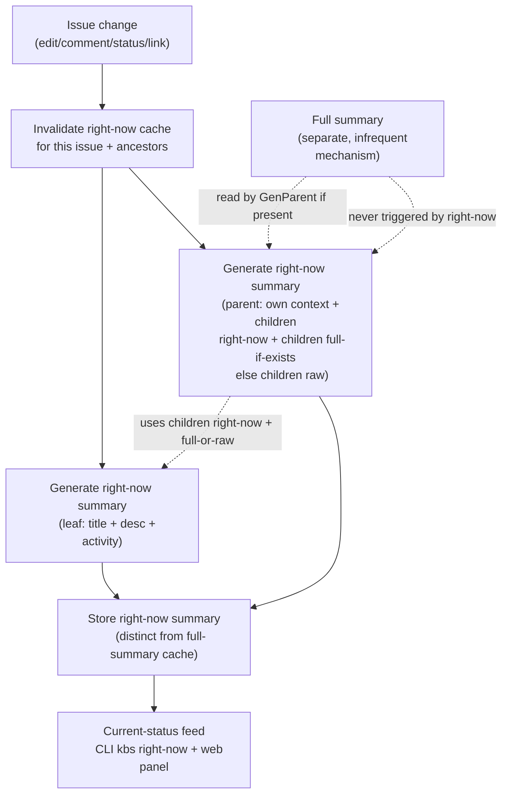

# PR FAQ: Right-Now Summary

> Working Backwards document for the "right-now summary" initiative. This document is the authoritative body of the Kanbus Initiative. It is a product spec, not an implementation spec; Gherkin, Python, and Rust follow once the Initiative is approved.

## Press Release

**Kanbus introduces Right-Now Summary: a one-sentence status for every issue, the instant it changes**

*New glanceable feed lets agents and humans see what is happening across the whole board without reading a single issue body.*

KANBUS, Sept. 2, 2026 — Kanbus today announced Right-Now Summary, a new way to understand a Kanbus board at a glance. Every time an issue changes, Kanbus rewrites that issue into a single short sentence in the style of an Apple Intelligence notification summary: terse, Hemingway-style, never longer than one line. The summaries flow into a reverse-chronological current-status feed in the web console and a new `kbs right-now` command for agents, so anyone can scan the whole board in seconds instead of opening issue after issue.

Issue titles are written for the future and issue bodies accumulate history. Neither is good for "what is happening right now." A 4,000-word epic description tells you what the epic is for, not that the auth refactor landed yesterday and the migration is blocked on a review. Right-Now Summary closes that gap. It is computed the moment an issue changes, cached, and shown next to the title in the feed. It recurses up the hierarchy: a task's right-now summary rolls into its epic's right-now summary, which rolls into its initiative's right-now summary, so the top of the board reads like a news ticker for the whole project.

"Right-Now Summary turns a Kanbus board from a filing cabinet into a newsroom," said a Kanbus maintainer. "You look at the feed and you already know the story."

Getting started is a single command. Run `kbs right-now` for a reverse-chronological list of recently-updated issues, each with its title and its right-now summary. Add `--tree` to see initiatives at the top, epics nested beneath them, and tasks beneath those, in a collapsible tree that defaults to expanded or collapsed as you choose. In the web console, the same data powers a current-status panel that updates in real time as issues change.

For an agent triaging a board it has never seen, the feed is the difference between reading thirty issues and reading thirty sentences. For a human catching up after a day away, it is the difference between a wall of cards and a headline.

Right-Now Summary is available today in Kanbus.

## Tenets

These are the principles the design must not violate. They are the rules we will test against.

1. **One sentence, always.** A right-now summary is one short line or sentence. Never two. Never a paragraph. If it does not fit, it is wrong, not longer.
2. **Glanceable before complete.** The feed is for scanning, not reading. A missing or stale summary must never block the feed from rendering.
3. **State is not prose.** The summary captures the *substance* of what is happening, never the *state label*. It must not say an issue is "done," "in progress," or "blocked," because the status field already says that. It may shift tense (past tense for completed work) because that describes the work, not the enum.
4. **Right-now is cheap; full is dear.** Right-now summaries run on every change and must be fast and cheap. Full summaries are expensive and run rarely, on a separate mechanism. Right-now never triggers full.
5. **Use what exists; never wait for it.** When a parent's right-now summary is built, it uses the children's right-now summaries and any full summaries that already exist. If a child has no full summary yet, the parent reads the child's raw issue. It never asks for a full summary to be made first.
6. **Cache, don't recompute.** A right-now summary is computed once per change and cached until the next change. The feed reads the cache.
7. **One way, in both runtimes.** Python and Rust produce identical observable behavior for the same inputs. No fallbacks, no legacy paths.

## Customer Personas

**The Agent.** A long-running agent that wakes up, looks at a board it may have never seen, and must decide what to do next. It cannot afford to read every issue body. It needs the board's current story in a single CLI call it can parse: `kbs right-now`. The hierarchical tree lets it drill from an initiative's one-sentence status down to the tasks underneath without a second round of `kbs show` calls.

**The Human.** A maintainer returning to a board after a day or a week. They want to know what moved, what is stuck, and what landed, without opening cards. The web console's current-status panel gives them that in a glance, updating live as the board changes.

## Goals and Non-Goals

### Goals

- A right-now summary for every issue, one short sentence, Apple-Intelligence-notification tone, recomputed on every change to the issue.
- A reverse-chronological current-status feed of recently-updated issues, each showing title + right-now summary, in both the CLI (`kbs right-now`) and the web console.
- Hierarchical roll-up: a parent's right-now summary is built from its children's right-now summaries plus any existing full summaries, falling back to raw children when no full summary exists.
- Optional collapsible tree view (Initiative > Epic > Task > Sub-task) with a configurable default expand/collapse state, in both CLI and web.
- Full behavior spec (Gherkin) coverage of all of the above.
- Python/Rust parity for all observable behavior.

### Non-Goals

- Changing the existing `kbs summarize` / `kbs lifecycle compact` full-summary machinery. That stays as the separate, expensive, infrequent tier.
- Defining the trigger mechanism for full summaries. That is a related but distinct concern and is left as an open question.
- Replacing issue titles or descriptions. Right-now summary is a derived, cached view, not a stored rewrite of the issue body.
- Summarizing non-issue entities (wikis, comments in isolation). Right-now summary is per-issue.

## FAQ — External

**What is Right-Now Summary?**
A single short sentence per issue that says what is happening with that issue right now, recomputed every time the issue changes. It shows up next to the title in the current-status feed.

**Where does it show up?**
In the web console's new current-status panel and in the CLI via `kbs right-now`. Both show recently-updated issues reverse-chronologically with title + right-now summary.

**Is it always available?**
The feed is always available. If a summary has not been computed yet (for example, a brand-new issue), the feed shows the title with the summary pending or omitted, never blank-stalling the render.

**Can I disable it?**
Right-now summary generation can be disabled via configuration (open question: exact key). When disabled, the feed still renders with titles only.

**Is it stored?**
Yes. Each right-now summary is cached on the issue and invalidated on the next change to that issue. It is distinct from the full-summary cache.

**Does it replace `kbs summarize`?**
No. `kbs summarize` produces a full summary (rewritten description + activity summary) and is the expensive, infrequent tier. Right-Now Summary is the cheap, frequent tier. They coexist.

**How does it handle the hierarchy?**
A parent issue's right-now summary is built from its children's right-now summaries and any full summaries the children already have. If a child has no full summary, the parent reads the child's raw issue instead. Right-now never asks for a full summary to be produced.

## FAQ — Internal

**What generates the summary?**
An LLM, via the same LiteLLM provider path used by the existing `summarize` machinery (see `python/src/kanbus/summarize.py`, `rust/src/summarize.rs`). Right-now uses a dedicated, tighter prompt and a smaller word budget than full summaries.

**What is the exact context for a right-now summary?**
For a leaf issue: title + description + recent activity (comments, status transitions), bounded by a token budget. For a parent issue: the parent's own title/description/activity plus, for each child, the child's right-now summary AND the child's full summary if one exists; if no full summary exists, the child's raw issue (title + description + activity) is used instead.

**Does right-now ever trigger a full summary?**
No. This is a hard rule. Right-now only consumes full summaries that already exist. Full summaries are produced by a separate, less-frequent mechanism (open question: the trigger).

**When is a right-now summary invalidated?**
On any change to the issue: description edit, comment added, status change, label change, assignment change, parent/child link change. The exact event set is an open question but the default is "any write to the issue."

**When a child's right-now summary changes, is the parent's invalidated too?**
Yes. Because the parent's context includes the child's right-now summary, a change to a child invalidates the parent's right-now summary (and recursively up the chain, bounded by the hierarchy). The propagation rule is an open question to nail down in the spec.

**Where is the right-now summary stored?**
Open question. Candidates: a new `comment_type` (e.g. `right_now`), a dedicated field on the issue, or reuse of the existing summary comment. The "no backward-compat / one way" policy means we pick exactly one and migrate, not support several. The PR FAQ recommends a dedicated storage slot distinct from the full-summary comment, but the final choice is deferred to the spec phase.

**What is the word/length budget?**
One sentence. Open question: a hard character or word cap (e.g. <= 120 characters) to enforce "one line" across terminals and the web panel.

**What is the recursion depth bound?**
The configured hierarchy in `.kanbus.yml` (`initiative -> epic -> task -> sub-task`). Right-now rolls up the parent chain to the top. Max depth is therefore the hierarchy depth. Per-level truncation of child context is an open question.

**What about cost and latency?**
Because right-now runs on every change, cost and latency matter more than for full summaries. The design must use a small prompt and a fast model. Offline / no-provider behavior is an open question: recommended fallback is to leave the previous right-now summary in place rather than emit an error.

**How is "no state duplication" enforced and tested?**
The prompt instructs the model not to restate status. Testing exact wording is brittle, so the Gherkin specs will assert structural properties (length cap, absence of status keywords, presence after a change) rather than exact strings, plus a parity check that Python and Rust agree.

**How do Python and Rust stay in parity?**
Same prompt, same context assembly, same cache key, same invalidation rules, same JSON shape for the cached summary, same CLI output formatting and ordering. Parity is verified with `tools/check_spec_parity.py` and byte-for-byte comparison where deterministic.

## Open Questions

These are deferred to the spec phase (after Initiative approval). The PR FAQ takes a recommended position where noted but does not lock it in.

1. **Full-summary trigger mechanism.** What produces full summaries and when? Manual `kbs summarize`? A scheduled job? An age/size threshold? A hook? Out of scope for this initiative's implementation, but must be named so the two tiers stay decoupled. Recommended: leave the existing manual + `lifecycle compact` triggers as-is.
2. **Right-now invalidation event set.** Confirm "any write to the issue" means: description edit, comment, status change, label change, assignment change, parent/child link change. Define the exact set.
3. **Parent invalidation propagation.** When a child changes, how far up the chain do we invalidate, and do we regenerate eagerly or lazily on next feed read? Recommended: invalidate up the chain eagerly, regenerate lazily on read.
4. **Storage location.** New `comment_type`, dedicated issue field, or reuse of existing summary comment. Must reconcile with the "no backward-compat / one way" policy. Recommended: a dedicated storage slot distinct from the full-summary comment.
5. **Context budget when full summaries are absent.** If many children lack full summaries, the parent reads all their raw issues. Define a token/size budget and truncation/fallback behavior. Recommended: cap total child-raw context, truncate oldest/lowest-priority children first.
6. **Length cap.** Hard character or word limit to enforce "one line." Recommended: <= 120 characters.
7. **LLM provider/model and offline behavior.** Which model for the right-now tier, and what happens when no provider is configured. Recommended: same provider as full summaries, smaller/faster model; on failure, keep the previous summary.
8. **Default expand/collapse for the tree view.** And whether the web panel and CLI share that default. Recommended: shared default, configurable, default collapsed except for the top level.
9. **Determinism of "no state duplication."** How to instruct the LLM reliably and how to test it in Gherkin. Recommended: structural assertions, not exact-string.
10. **Real-time updates in the web panel.** Does the current-status panel subscribe to the existing realtime feed (MQTT-over-WSS / SSE in `apps/console/src/api/client.ts`) so summaries update live? Recommended: yes.

## Appendix: Proposed CLI and UI Surface

### CLI

```
kbs right-now [options]

Options:
  --limit <n>          Number of recently-updated issues to show (default 30)
  --tree               Show issues hierarchically (Initiative > Epic > Task > Sub-task)
  --expanded           With --tree, expand all nodes by default
  --collapsed          With --tree, collapse all nodes by default (default)
  --raw                Show titles only, no right-now summaries (for offline / debugging)
  --json               Emit machine-readable JSON for agents
```

Default (flat, reverse-chronological) output, one row per recently-updated issue:

```
<updated_at>  <id>  <title>
              <right-now summary>
```

With `--tree`, initiatives appear at the top level, epics nested beneath their initiative, tasks beneath their epic, each indented and prefixed with a collapse marker, each showing title + right-now summary.

### Web Console

A new **Current Status** panel in the console:

- Reverse-chronological feed of recently-updated issues, title + right-now summary per row.
- Optional hierarchical tree toggle (Initiative > Epic > Task > Sub-task), collapsible nodes, default expand/collapse from configuration.
- Subscribes to the existing realtime feed so rows and summaries update live as issues change.
- A right-now summary that is pending or unavailable renders as the title only; the feed never blocks.

### Data flow



## Status

This is a PR FAQ, not an approved plan. Filing this document as a Kanbus Initiative begins the review. Epics, Tasks, and Gherkin scenarios are written after the Initiative is approved.
